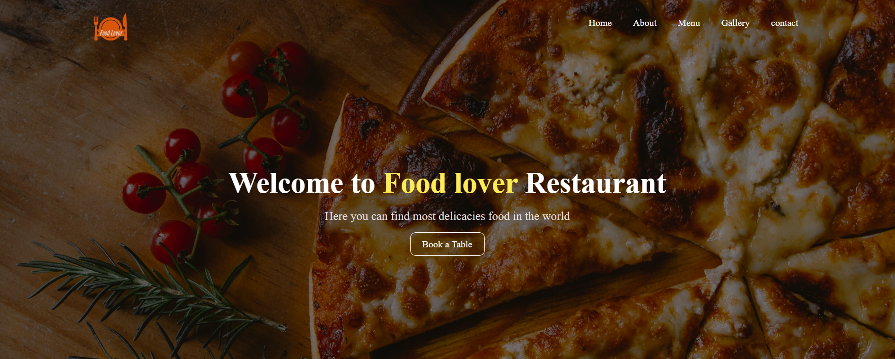

# Food Lover Restaurant Website

Food Lover is a simple and responsive website designed for a restaurant, showcasing its offerings, menu, special deals, and more. Built using HTML and CSS, the website provides an engaging user experience for customers to explore the restaurant's details, meals, and promotions.

## Features

- About Us: A section introducing the restaurant, its story, and its passion for food.

- Menu: Displays the restaurant's menu with details about meals, including descriptions and prices.

- Offers: Highlights ongoing promotions, discounts, and special deals.

- Meal Details: Provides detailed information about specific meals, including ingredients and preparation.

- Gallery: A visual showcase of the restaurant's dishes, ambiance, and culinary expertise.

## How to Use

1. Clone or download the repository.

2. Open the index.html file in your browser to view the website.

3. Explore the different sections: About Us, Menu, Offers, Meal Details, and Gallery

## Future Enhancements

- Integrate a backend for online reservations or orders.

- Optimize for mobile devices and improve responsiveness.
## Screenshots

## Authors

- [@rabha79](https://github.com/rabha79)

"# HTML-CSS" 
